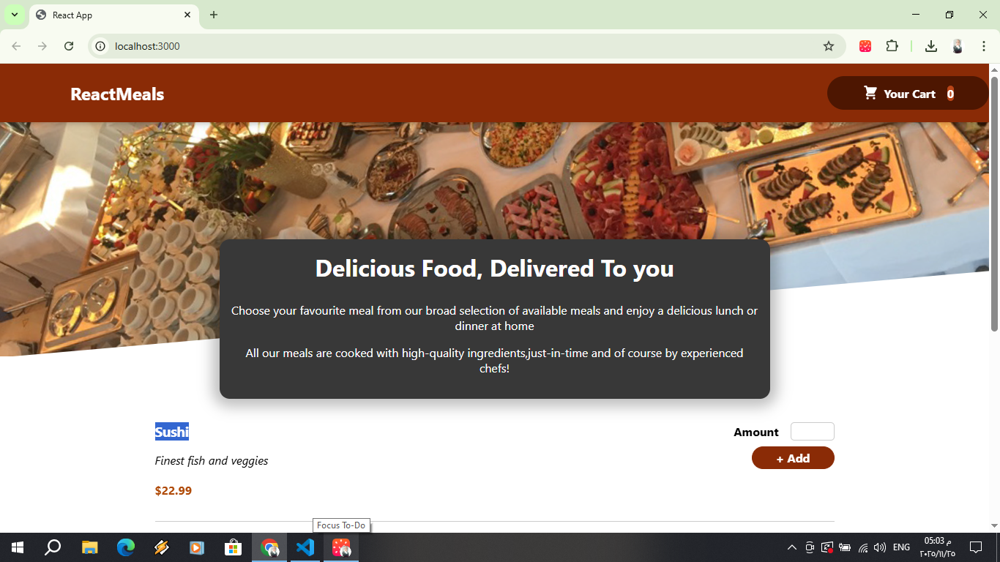
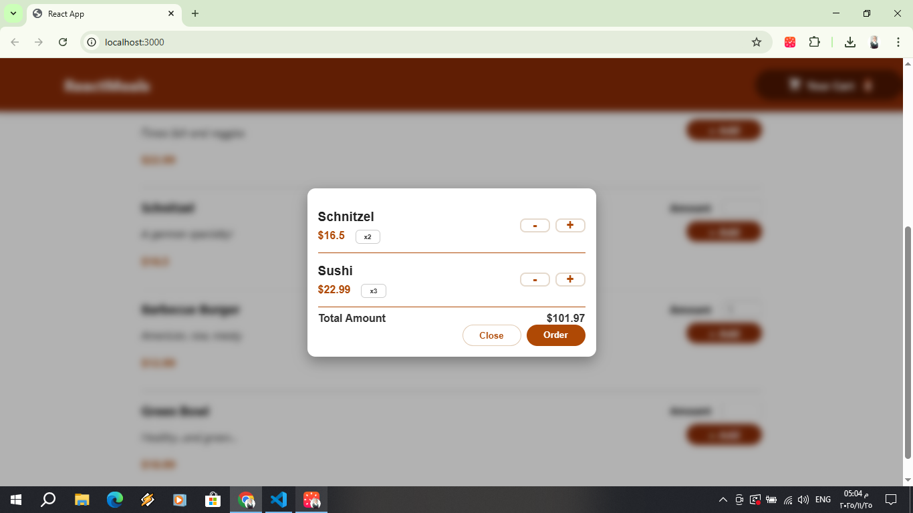
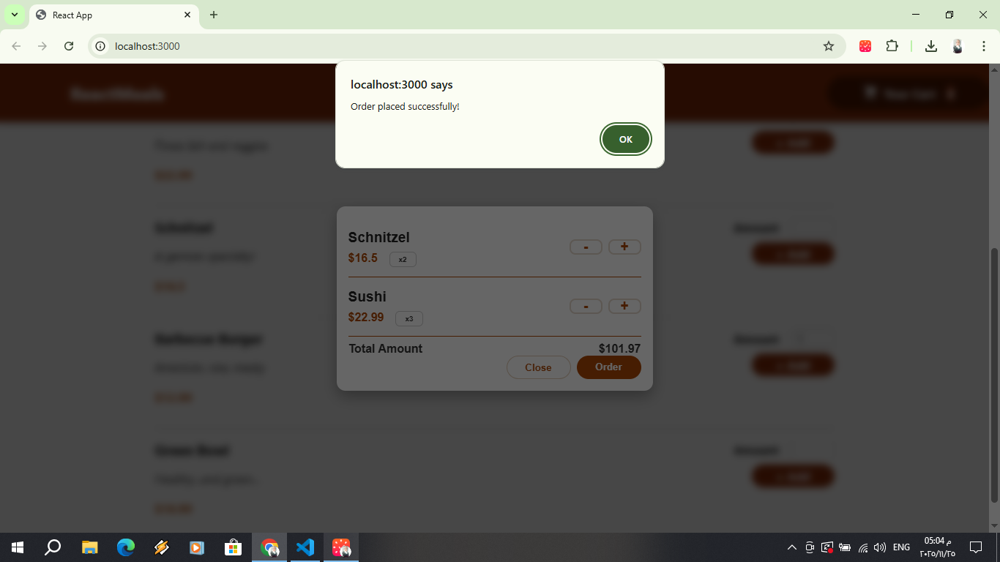

# Forever Project

This is a React-based food web application.

##  Technologies Used

- **Frontend:**
  - React.js
  - JavaScript


##  Getting Started

Follow these steps to run the project locally:

1. **Clone the repository:**
   ```bash
   git clone https://github.com/alaafawzyyyy/Food

2. **Navigate to the project folder:**
   ```bash
    cd Food

3. **Install dependencies:**
   ```bash
    npm install

4. **Start the development server:**
   ```bash
    npm start

## Screenshots




